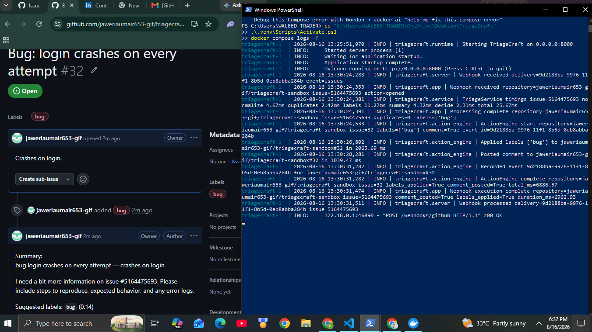

# TriageCraft

GitHub App for automated issue triage: duplicate detection, label suggestions, issue summaries, and safe webhook handling.

[](#)
[](#)
[](#)
[](#)

## Demo

- Receives GitHub issue webhook events through a public tunnel
- Processes new issue openings and ignores follow-up label events
- Suggests labels and posts maintainer-friendly triage feedback
- Validates the project with lint, tests, Docker build, and smoke checks


## How it works

1. A GitHub issue webhook hits the app.
2. The triage engine analyzes the issue, suggests labels, and checks for missing information.
3. The action layer applies the safe response and ignores repeat follow-up events.

## Architecture

GitHub Issue -> Webhook -> TriageCraft -> Decision Engine -> Label / Comment / Ignore

## Why this exists

Open-source maintainers spend a significant amount of time on repetitive triage work, including:

* checking whether a new issue is a duplicate
* assigning the right labels
* reading long comment threads and issue descriptions
* asking for missing logs, steps to reproduce, or version details
* replying to common questions and support requests

TriageCraft is designed to reduce that workload while keeping maintainers in control of the final decision.

## What it does

* Detects possible duplicate issues
* Suggests labels such as `bug`, `feature`, `docs`, and `question`
* Summarizes long issue content into a short maintainer-friendly view
* Flags missing information in new issues
* Supports dry-run mode for safe testing and validation

## Demo

- GitHub webhook receives issue events through the public tunnel
- The app processes `opened` issues and ignores `labeled` follow-up events
- GitHub Actions stays green with lint, tests, build, and smoke test

## What it does not do

* It does not merge pull requests
* It does not close issues automatically without confidence
* It does not delete user content
* It does not modify code
* It does not replace maintainers

## Project status

TriageCraft is in active development.

Current focus:

* problem definition
* architecture design
* workflow design
* MVP planning and implementation

## Planned MVP

* GitHub App authentication
* Webhook event handling
* Duplicate detection
* Label suggestions
* Short issue summaries
* Repository configuration file
* Safe comment posting
* Dry-run mode

## Repository structure

* `docs/problem-definition.md` — problem statement and scope
* `docs/architecture.md` — system architecture
* `docs/workflow.md` — event and decision flow
* `docs/roadmap.md` — phased development plan

## Quick start

1. Copy `.env.example` to `.env`
2. Copy `.triagecraft.example.yml` to `.triagecraft.yml`
3. Edit `.env` and `.triagecraft.yml`
4. Install dependencies
5. Run the app

## Run locally

```powershell
python -m triagecraft
```

## Required environment variables

```text
TRIAGECRAFT_GITHUB_TOKEN
TRIAGECRAFT_CONFIG_PATH
TRIAGECRAFT_DB_PATH
TRIAGECRAFT_HOST
TRIAGECRAFT_PORT
TRIAGECRAFT_LOG_LEVEL
```

## Deployment notes

* `dry_run: true` is recommended while testing
* webhook signatures should use `webhook_secret`
* `TRIAGECRAFT_GITHUB_TOKEN` should be kept private
* the SQLite database file is created automatically if needed

## Contributing

Contributions will be welcomed after the MVP structure is finalized.

## License

See `LICENSE`.
